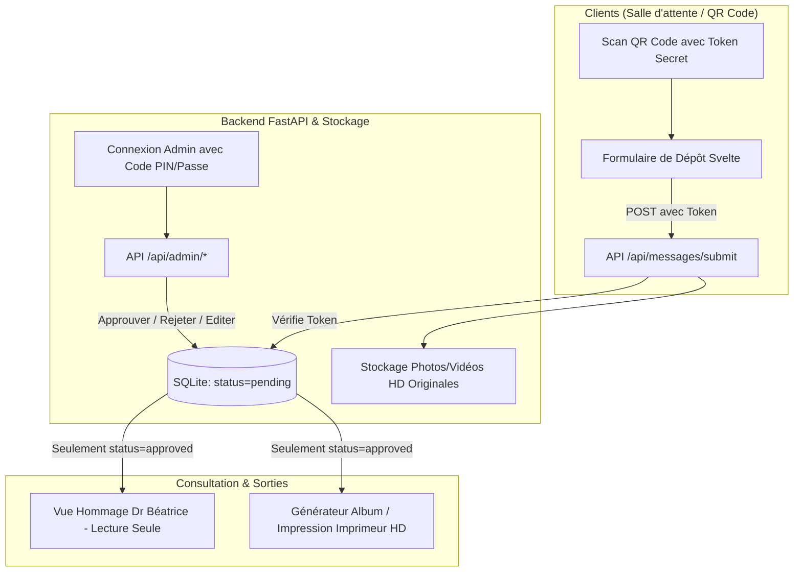

# Livre d'Or Numérique pour le Dr Béatrice

Création d'une application web sur-mesure (Svelte + FastAPI + SQLite) permettant aux clients de déposer leurs messages et photos de remerciement pour le départ en retraite du Dr Béatrice.

Le système privilégie la simplicité d'usage, la protection contre le spam/parasitage, une modération préalable obligatoire, un affichage élégant en lecture seule pour la vétérinaire, et un support d'exportation pour impression papier haute qualité.

---

## 1. Principes d'Architecture et Sécurité

### Protection & Modération
1. **URL de soumission avec Jeton Sécurisé (Slug secret)** :
   * L'accès au formulaire client se fait via une URL spécifique, par exemple `/participer/beatrice-retraite-7x8k2q`, encodée dans le QR code imprimé pour la clinique.
   * La racine du domaine n'expose aucun formulaire d'écriture direct aux robots d'indexation.
2. **Pas de limiteur de débit agressif** :
   * Évite tout blocage lors de pics de connexions simultanées en salle d'attente ou lors d'envois groupés de newsletters.
3. **Modération a priori systématique** :
   * Tout message soumis est enregistré avec `status = "pending"`.
   * Il n'est **jamais visible** sur la page du livre d'or ni sur l'écran du Dr Béatrice avant validation explicite.
4. **Photos et Vidéos en Pleine Résolution** :
   * Les photos sont stockées dans leur résolution d'origine sans compression dégradante, afin d'alimenter à la fois l'affichage web plein écran et le support d'impression pour l'imprimeur.

---

## 2. Découpage Fonctionnel

### Vue 1 : Formulaire Client (`/participer/:token`)
* Optimisé pour smartphones (accès immédiat après scan QR Code).
* Champs :
  * Nom / Prénom de la famille
  * Nom de l'animal & Espèce (Chien, Chat, NAC, Cheval, etc.)
  * Années de suivi (ex : *« Soigné depuis 2014 »*)
  * Message / Anecdote
  * Photo ou courte vidéo (glisser-déposer ou sélection directe depuis la galerie du téléphone)
* Message chaleureux de confirmation : *« Merci beaucoup ! Votre mot a bien été enregistré et sera intégré au livre d'or du Dr Béatrice. »*

### Vue 2 : Livre d'Or Hommage (Lecture Seule) (`/`)
* Conçue spécifiquement pour le Dr Béatrice et les visiteurs.
* Interface élégante, douce et chaleureuse, sans aucun bouton d'édition ni interface d'administration apparente.
* Grille de cartes souvenirs avec photos haute définition, filtres par animal (Tous, Chiens, Chats, NACs...), zoom grand format au clic.
* **Mode Diaporama / Plein écran** : Idéal pour projeter les messages en boucle lors de son pot de départ.

### Vue 3 : Panneau de Modération (`/admin`)
* Accès protégé par mot de passe / code PIN.
* Tableau de bord avec 3 onglets : *À valider (Pending)*, *Approuvés*, *Rejetés / Masqués*.
* Actions en 1 clic : **Valider**, **Masquer**, **Supprimer**, ou **Corriger une faute d'orthographe**.

### Vue 4 : Support Imprimeur & Export Livre Papier (`/imprimer` ou `/export`)
* Feuille de style dédiée à l'impression haute définition (`@media print` avec gestion des sauts de page A4 / Album paysage).
* Utilisation des images sources en pleine résolution (300 DPI) sans perte de qualité.
* Option d'export HTML/PDF vectoriel autonome directement livrable à un imprimeur ou imprimable en PDF haute qualité.

---

## 3. Modifications et Fichiers Prévus

### Backend (FastAPI + SQLite)
#### [NEW] `backend/requirements.txt`
* Dépendances : `fastapi`, `uvicorn[standard]`, `python-multipart`, `sqlalchemy`, `pydantic`.
#### [NEW] `backend/app/main.py`
* Configuration de FastAPI, CORS, et montage des routes statiques pour les médias uploadés.
#### [NEW] `backend/app/models.py`
* Modèle SQLite : `id`, `author_name`, `pet_name`, `pet_species`, `years_known`, `message`, `media_path`, `media_type`, `status`, `created_at`.
#### [NEW] `backend/app/routes/messages.py`
* Endpoint public de soumission avec validation du token secret.
* Endpoint public de consultation des messages approuvés uniquement.
#### [NEW] `backend/app/routes/admin.py`
* Endpoints de modération protégés par authentification PIN/Token.
#### [NEW] `backend/app/config.py`
* Configuration des chemins de médias, token secret de participation et mot de passe admin.

### Frontend (Svelte + Vite)
#### [NEW] `frontend/package.json`
* Configuration du projet Svelte avec Vite.
#### [NEW] `frontend/src/App.svelte`
* Routage léger (Vue Hommage, Vue Dépôt avec token, Vue Modération, Vue Impression).
#### [NEW] `frontend/src/lib/HomeView.svelte`
* Galerie interactive pour Dr Béatrice, cartes polaroïds, zoom HD, lecteur vidéo.
#### [NEW] `frontend/src/lib/SubmitForm.svelte`
* Formulaire mobile pour les clients avec vérification du jeton.
#### [NEW] `frontend/src/lib/AdminView.svelte`
* Interface de modération intuitive.
#### [NEW] `frontend/src/lib/PrintView.svelte`
* Mise en page livre souvenir pour impression papier professionnelle.

---

## 4. Plan de Vérification

### Tests automatisés & API
* Vérification des endpoints FastAPI (création avec token valide vs invalide, modération, récupération des messages approuvés uniquement).
* Test d'upload de fichiers images et vidéos.

### Tests manuels
1. **Soumission client** : Accès via l'URL avec token, saisie d'un message avec photo, vérification qu'il n'apparaît **pas** immédiatement sur la page d'accueil.
2. **Modération** : Connexion à l'espace admin, validation du message.
3. **Affichage hommage** : Constat de l'apparition immédiate du message sur la page publique et test du zoom photo HD.
4. **Vérification impression** : Aperçu d'impression (Ctrl+P) et rendu du template d'album imprimable haute résolution.
